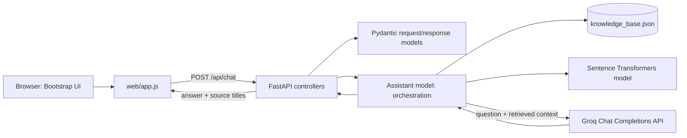
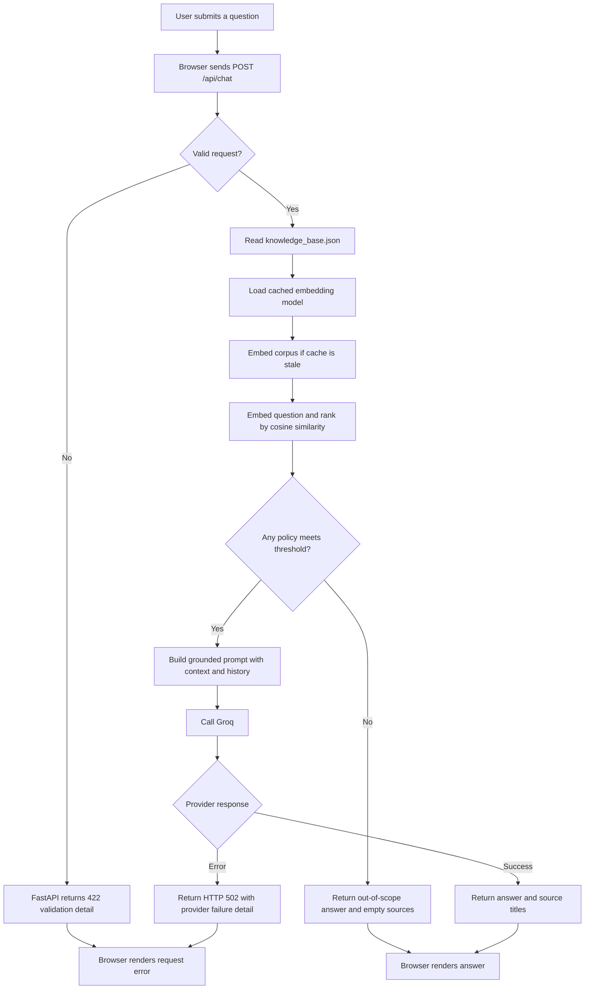

# Architecture

## Components



## MVC mapping

| MVC concern | Project location | Responsibility |
| --- | --- | --- |
| Model | `app/models/` | Pydantic API schemas and assistant behavior: load policies, retrieve by embeddings, call Groq, format sources. |
| Controller | `app/controllers/` | Validate and route health/chat HTTP requests, translate assistant failures to HTTP errors. |
| View | `web/` | Responsive chat page, Bootstrap-based layout, styling, browser-side conversation and API calls. |
| Application composition | `app/main.py` | Creates FastAPI app, mounts static assets, includes routes, serves the home page. |

## Chat request sequence

```mermaid
sequenceDiagram
    actor User
    participant UI as Browser UI (web/app.js)
    participant API as FastAPI chat controller
    participant Assistant as Assistant model
    participant KB as knowledge_base.json
    participant Embed as Sentence Transformers
    participant Groq as Groq API

    User->>UI: Submit question
    UI->>UI: Show "Searching policies" status
    UI->>API: POST /api/chat (message, history)
    API->>API: Validate ChatRequest
    API->>Assistant: answer_question(payload)
    Assistant->>KB: Load policy entries
    KB-->>Assistant: Policy titles and text
    Assistant->>Embed: Encode policies (cached) and question
    Embed-->>Assistant: Normalized vectors
    Assistant->>Assistant: Rank cosine similarity; keep up to 3 above threshold
    alt Relevant policies found
        Assistant->>Groq: Prompt + relevant policy context + recent history
        Groq-->>Assistant: Grounded answer
    else No relevant policies found
        Assistant->>Assistant: Return fixed out-of-scope answer
    end
    Assistant-->>API: Answer and source titles
    API-->>UI: JSON response
    UI->>UI: Replace pending status with answer and sources
```

## Request flow



## Runtime and caching

- Sentence Transformer weights are loaded lazily and the model object is cached in the process.
- Policy vectors are cached in memory and rebuilt when the embedding model name or policy corpus changes.
- The first use needs the model files locally or outbound access to the Hugging Face Hub. The public default model does not require `HF_TOKEN`.
- Generation uses Groq's OpenAI-compatible Chat Completions endpoint. The secret key stays on the server and is not passed to browser JavaScript.
- Docker sets `HF_HOME=/model-cache`; mount a named volume at that path to persist model files.
